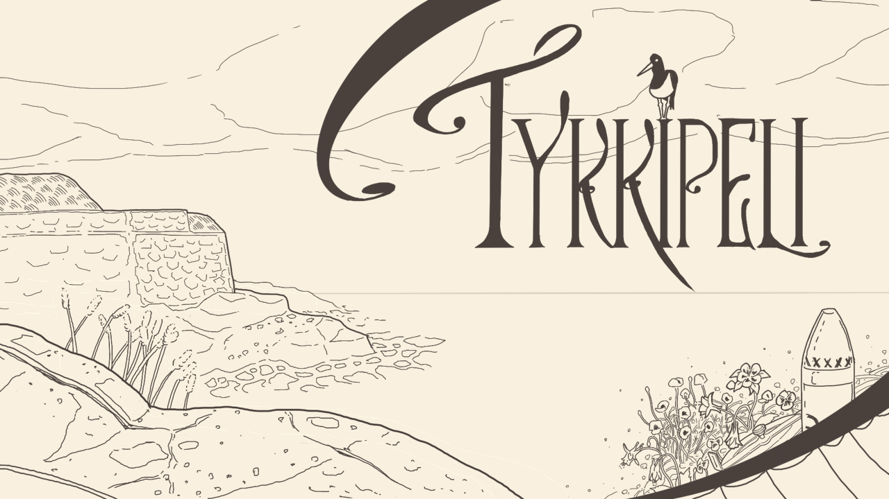

# Tykkipeli - Ohjelmistotekniikan harjoitustyö

## Sisällysluettelo

- [Sisällysluettelo](#sisällysluettelo)
    - [Kuvaus](#kuvaus)
    - [Dokumentaatio](#dokumentaatio)
    - [Releaset](#releaset)
    - [Asennus ja projektin käyttö](#asennus-ja-projektin-käyttö)
        - [Linux](#Linux)
        - [Windows](#Windows)

## Kuvaus

Perinteinen tykkipeli jossa pelaaja yrittää osua laivoihin tykin kulmaa ja ammuksen nopeutta muuttamalla. 

Haasteena osumiselle on laivojen liikkumisen lisäksi dynaaminen fysiikkasimulaatio, joka ottaa ilmanvastuksen, maapallon pyörimisen sekä tuulen vaikutuksen huomioon. Viimeisessä ominaisuudessa tuulen suunta ja nopeus haetaan reaaliajassa Ilmatieteenlaitoksen rajapinnasta Harmajan mittausasemalta. 

Pelin pisteet tallennetaan sekä paikallisesti että julkisesti nettiin.

## Dokumentaatio

[Käyttöohje](/dokumentaatio/kayttoohje.md)

[Vaatimuusmäärittely](/dokumentaatio/vaatimusmaarittely.md)

[Testaus](/dokumentaatio/testaus.md)

[Arkkitehtuurikuvaus](/dokumentaatio/arkkitehtuuri.md)

[Tuntikirjanpito](/dokumentaatio/tuntikirjanpito.md)

# Releaset

[Loppupalautus](https://github.com/sainigma/ot-harjoitustyo/releases/tag/1.0)

[Viikko 6](https://github.com/sainigma/ot-harjoitustyo/releases/tag/0.8)

[Viikko 5](https://github.com/sainigma/ot-harjoitustyo/releases/tag/0.6)

# Asennus ja projektin käyttö

Projektin käytössä on käyttöjärjestelmien välillä pieniä eroja. Dokumentaatiot linuxille ja windowsille:

# Linux

Lataa repositorio manuaalisesti, navigoi Tykkipeli-kansion juureen ja anna [run.sh](/Tykkipeli/run.sh) skriptalle ajo-oikeudet

    git clone https://github.com/sainigma/ot-harjoitustyo.git
    cd ot-harjoitustyo/Tykkipeli
    chmod +x ./run.sh

## Testaus

Mahdollisia komentoja run-skriptalle ovat test, jolla ajetaan testit ja luodaan kattavuusraportti, checkstyle joka lintterin ja luo siitä raportin, sekä javadoc joka luo projektille javadocin. 

    ./run.sh test xdg-open
    ./run.sh checkstyle xdg-open
    ./run.sh javadoc xdg-open

Viimeinen parametri määrittää millä selaimella syntyneet raportit ajetaan (esim xdg-open avaa järjestelmän oletusselaimella, ./run.sh javadoc firefox avaisi firefoxilla), ja sen voi jättää pois jos riittää pelkkä raportin päivitys.

## Kääntö

Ohjelma käännetään run-skriptan build-komennolla ja mahdollisia parametreja ovat:

    ./run.sh build lin64
    ./run.sh build win64
    ./run.sh build osx64
    ./run.sh build win32
    ./run.sh build all

Kääntäminen luo projektista Tykkipeli_natiivi.zip (esim Tykkipeli_lin64.zip) tiedoston Tykkipeli/builds/ kansioon halutulla natiivilla. Parametri all kääntää projektin kaikille natiiveille helpompaa releasea varten.

## Ajo

Pura Tykkipeli_natiivi.zip kansioon ja joko tuplaklikkaa Tykkipeli.jar tiedostoa tai aja kansiossa

    java -jar Tykkipeli.jar

# Windows

## Kääntö & ajo

    git clone https://github.com/sainigma/ot-harjoitustyo.git
    cd ot-harjoitustyo/Tykkipeli
    mvn compile exec:java -Dexec.mainClass=game.Main

## Pakkaus .jariksi

Tykkipeli kansion juuressa:

    mvn package

Tai jos kohdenatiivi on eri kuin nykyinen käyttöjärjestelmä:

    mvn -P lwjgl-natives-linux-amd64 package
    mvn -P lwjgl-natives-windows-amd64 package
    mvn -P lwjgl-natives-macos-amd64 package
    mvn -P lwjgl-natives-windows-x86 package

Paketti luodaan target -kansioon, ja sen voi ajaa komennolla

    java -jar Tykkipeli.jar

Julkaisua varten siirrä Tykkipeli.jar kansioon ja kopioi kansion juureen Tykkipelin assets kansio. Zippaa.

## Testit & dokumentaatio

Tykkipeli kansion juuressa:

    mvn test
    mvn test jacoco:report
    mvn jxr:jxr checkstyle:checkstyle
    mvn javadoc:javadoc

Generoitua kattavuusraporttia voi tarkastella polussa Tykkipeli/target/site/jacoco/index.html

Generoitua javadocdokumentaatiota voi tarkastella polussa Tykkipeli/target/site/apidocs/index.html