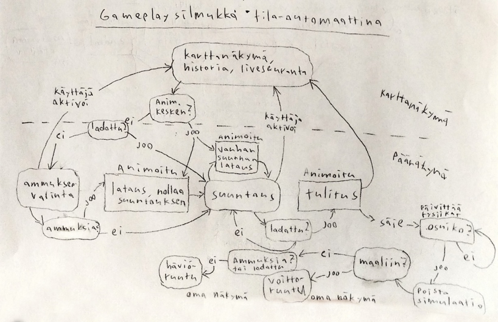
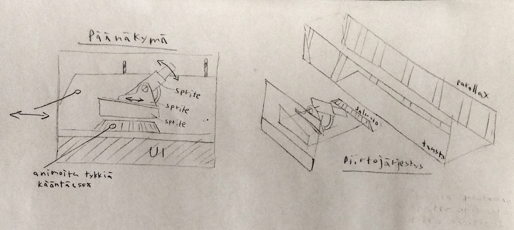
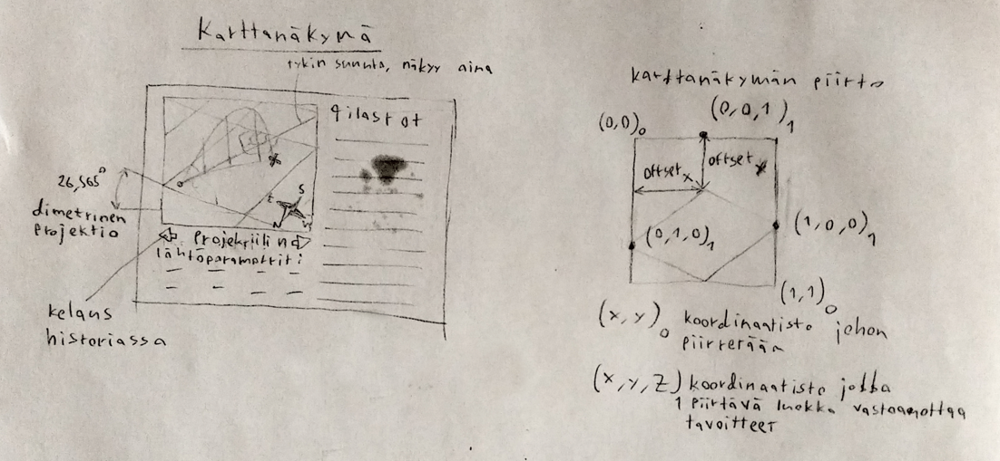

# Vaatimusmäärittely

## Sovelluksen tarkoitus

Perinteinen tykkipeli jossa pelaaja yrittää osua maaliin tykin kulmaa ja ammuksen nopeutta muuttamalla.

Pelin pääpelisilmukka on, että pelaaja yrittää osua maaliin erilaisia parametrejä muuttamalla. Pelin haastavuutta voidaan varioida sekä simulaation parametrejä, esim. tuulivektoria, muuttamalla, että tekemällä maaleista liikkuvia. Pelin voittoehtona on maaliin osuminen, häviöehtoina taas ammusten loppuminen tai maalin pääseminen liian lähelle.

## Pelisilmukka

## Pelin näkymät

Isot objektien ryhmittymät ovat omissa renderbuffereissaan. Mahdollisesti 3 bufferia (ui, peliobjektit, tausta)

Lentorata päivittyy karttanäkymään reaaliajassa. Pitkästä lentoajasta johtuen näkymän pitää osata piirtää useita projektiileja samanaikaisesti. Edellisiä lentoratoja pitää pystyä myös piirtämään uudelleen näkymään (esim. jos käyttäjä haluaa tarkastella projektiilihistoriaa) Jokainen projektiili voidaan esim. tallentaa omiin buffereihin joita pidetään koko pelin ajan muistissa.

Karttanäkymän täytyy myös pystyä piirtämään maali (esim. laiva) järkevästi (vähintään pisteenä/ikonina, mieluiten spritenä jota pystyy pyörittämään)

## Rajoitukset
- Peli pyörii Cubbli-linuxjakelulla ja käyttää kiinteää resoluutiota (joko 800x600 retrosyistä tai suoraan 720p reso&kuvasuhde)

## Perustoiminnallisuudet

- Käyttäjän kontrollit:
    - Projektiilin määritys
        - Massa, lähtönopeus, ajastus, vaikutusalueen koko
    - Lentoradan määritys tykin kulmaa ja suuntaa muuttamalla

- Käyttöliittymän näkymät
    - Näkymä alkuparametrien asettamiseen
        - Alinäkymä projektiilin määrittämiseen
    - Näkymä projektiilin lentoradan seuraamiseen
        - Piirtää lentoradan kartalle reaaliajassa ylhäältäpäin
        - Jatkaa piirtämistä myös kun näkymä ei ole aktiivinen

- Fysiikkasolveri
    - Abstrakti luokka, voidaan eriyttää erikoistapauksien laskemiseen
    - Ratkaisee ongelmaa aikaikkunassa, projektiilin sijainti voidaan laskea suoraan seuraavaan ruudunpiirtoon
    - Pysäyttää simulaation kun lopetusehdot täyttyy (aika ja/tai sijainti)

- Projektiilien lentorata
    - Kolmiulotteinen karteesinen koordinaatisto
    - Projektiilin massa ja nopeus vaikuttaa lentorataan ilmanvastuksen kautta
    - Ei ota huomioon maapallon pyörimistä tai kaarevuutta
    - Tuuli "työntää" projektiilia

- Paikallinen high-score lista

## Erikoistoiminnallisuudet (nice-to-have/jatkokehitys)

- Projektiilien lentorata
    - Maapallon kaarevuus ja pyöriminen vaikuttaa lentorataan
    - Gravitaation ja ilmantiheyden vaihtelu vaikuttaa lentorataan
    - Eötvösilmiö vaikuttaa lentorataan
    - Projektiileilla on lähtötilanteessa pyörimismäärää ja magnusilmiö vaikuttaa lentorataan

- Globaali high-score lista (sinällään triviaali toteuttaa, paitsi jos halutaan jonkinlainen huijauksenesto)