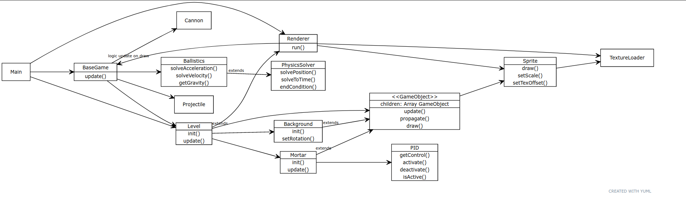

# Arkkitehtuurikuvaus

## Sovelluslogiikka

Pelin logiikka on jaettu kahteen tasoon. Ns. käyttöliittymätön sovelluslogiikka ajetaan BaseGame luokasta, kun taas objekteihin liittyvä logiikka, esim. animaatiot jne. ajetaan itse peliobjekteista. Koska peliobjektit voivat omistaa lapsipeliobjekteja, luokat kykenevät päivittymään itsenäisesti. Sekä BaseGame:n että GameObject perillisten päivitys kutsutaan Renderer-luokan piirtosilmukasta, ja GameObjectin kohdalla päivityskäsky propagoituu myös lapsiobjekteihin.

GameObject luokka päivitetään normaalisti Renderer-luokan piirtosilmukasta, mutta testien vuoksi (+päälogiikka on riippuvainen animaatioiden valmistumisesta) se voidaan päivittää myös ilman käyttöliittymän alustusta.

## Sekvenssikaaviot

### Pelilogiikan alustus, tykin lataus & laukaus ilman graafista käyttöliittymää

Sekvenssikaaviossa alustetaan peli ilman käyttöliittymää, eli miten logiikkaluokkia käsitellään esim. testeissä.

Sekvenssissä alustetaan oliot, haetaan uusi projektiili ammusvarastosta, lisätään se ammuttavaksi, ja lopuksi ammutaan. Jokaiselle projektiilille alustetaan uusi fysiikkasolveri.

Graafista käyttöliittymää hyödyntäviä luokkia (GameObject luokasta johdettuja, esim. mortar ja level) on yksinkertaistettu tähän kaavioon.