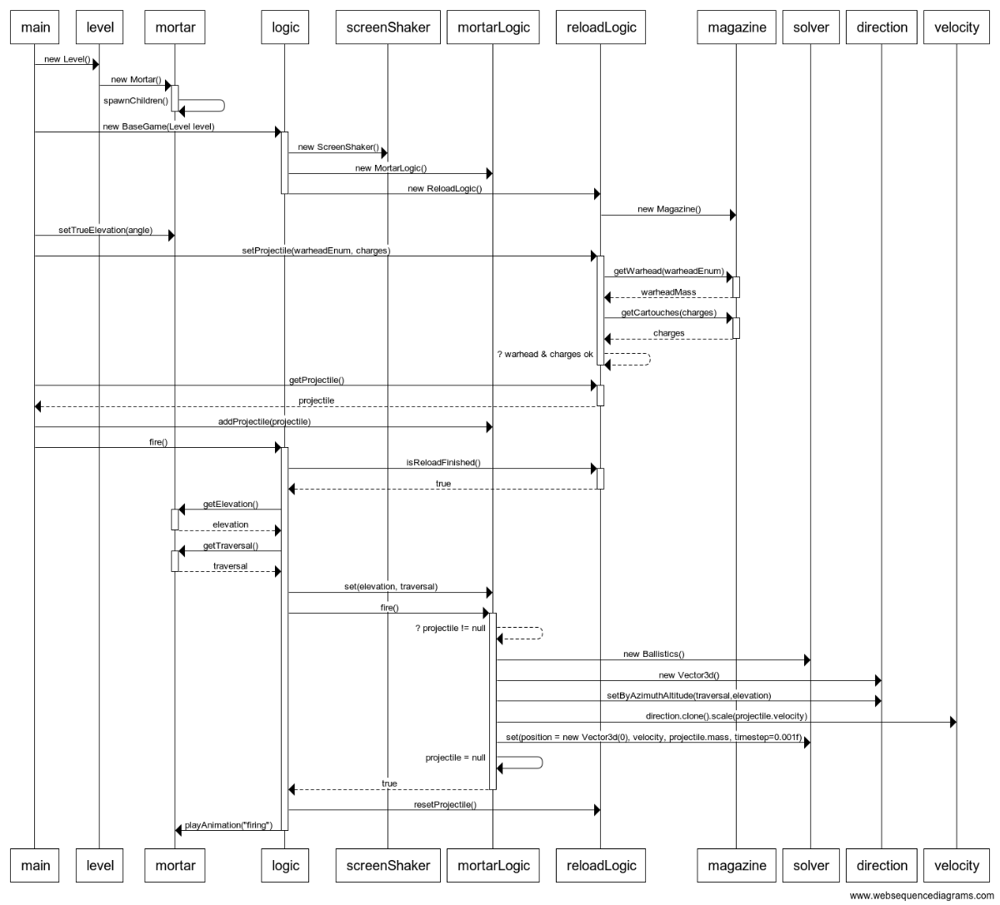

# Arkkitehtuurikuvaus

- Sisällysluettelo
    - [Pelimoottori](#Pelimoottori)
        - [Renderöinti](#Renderer)
        - [Logiikkarajapinta](#LogicInterface)
        - [Peliobjektirajapinta](#DrawCallInterface)
        - [Piirto](#ImmediateDrawer)
        - [Animointi](#Animation)
        - [Muut](#Muut)
    - [Tykkipeli](#Tykkipeli)
        - [Logiikka](#Logiikka)
        - [Simulaatio](#Simulaatio)
        - [Peliobjektit](#Peliobjektit)
        - [Pisteiden tallennus](#Pisteiden-tallennus)
    - [Esimerkit](#Esimerkit)

Arkkitehtuurikuvaus on jaettu kahteen osioon: pelimoottorin sekä itse pelin kuvaukseen. Pelimoottori toimii sovelluksen rakenteessa ensimmäisenä logiikkakerroksena, itse peli taas toimii sen puitteissa.

## Pelimoottori

Pelimoottori koostuu seuraavista paketeista ja yksittäisistä luokista:

 - game.graphics kokonaisuudessaan
    - [Renderer](#Renderer)
    - [ImmediateDrawer](#ImmediateDrawer)
 - game.graphics.primitives [kokonaisuudessaan](#ImmediateDrawer)
 - game.components kokonaisuudessaan
    - [DrawCallInterface](#DrawCallInterface)
 - game.components.animation [kokonaisuudessaan](#Animation)
 - [game.utils](#Muut)
 - game.logic
    - [LogicInterface](#LogicInterface)

### Renderer

Renderer luokka alustaa pelille ikkunan, näppäimistökuuntelija **InputManager**in sekä tekstuurinlataaja **TextureLoader**in. Luokka on myös vastuussa koko sovelluslogiikan päivittämisestä, joka tapahtuu kerran jokaisessa piirrossa.

Luokka kutsuu jokaisella piirrolla sille asetetun logiikkarajapinnan **LogicInterface**n päivitystä, sekä sen piirtojonoon asetettujen DrawCallInterface rajapinnan objektien piirtoa.

Tällä rakenteella voidaan toteuttaa sekä suljettuja että monimutkaisia logiikkakokonaisuuksia. Pelilogiikan alustus tapahtuu siten, että renderöijälle asetetaan jokin LogicInterface jolle asetuksen yhteydessä sidotaan viite nykyiseen renderöijään. Logiikkarajapinta voi tämän jälkeen spawnata tarvitsemansa peliobjektit ja lisätä ne renderöijän piirtojonoon. Uutta logiikkaa alustaessa logiikka poistaa peliobjektinsa piirtojonosta (kannattaa käyttää yhtä juuriobjektia, jolloin yhden objektin poisto riittää), alustaa uuden logiikkaobjektin ja asettaa sen itsensä tilalle renderöijän logiikkarajapinnaksi.

**TextureLoader** hoitaa tekstuurien lataamisen (**Texture** objekti, sisältää osoittimen tekstuuriin sekä tekstuurin dimensiot), pitää niistä kirjaa sekä varmistaa että jokainen tekstuuri ladataan näytönohjaimen muistiin vain kerran. Duplikaattien tapauksessa laturi palauttaa vain osoitteen jo alustettuun tekstuuriin.

### LogicInterface

Pelilogiikan pystyy toteuttamaan melko vapaasti. **LogicInterface** määrittää että luokalla täytyy olla vain **setInputManager**, **setRenderer** sekä **update** -metodit. Kaksi ensimmäistä sitoo luokan näppäimistökuuntelijaan ja renderöijään, jolloin luokka kykenee vastaanottamaan syötteitä sekä lisäämään asioita piirtojonoon. Update -metodilla taas logiikka kytkeytyy renderöijän päivityssykliin, renderöijä kutsuu jokaisella piirrolla sille asetetun LogicInterfacen päivitystä.

Piirtojonoon lisättävät objektit määritetään **game.components** paketin **DrawCallInterface**ssa. Interfacen tärkeimmät metodit ovat **draw**, **load**, **update** sekä kappaleen muunnoksen setterit/getterit. Draw metodilla kappale piirretään renderöijän piirtojonosta, update metodilla päivitetään implementaation sisäinen logiikka ja loadilla kappale alustetaan. Draw ja update ovat erillisiä metodeja, koska esimerkiksi ketjuttuneessa objektirakenteessa lapsiobjektien logiikka saatetaan haluta päivittää ilman varsinaista piirtoa.

### DrawCallInterface

**DrawCallInterface** on rajapinta paketista game.components joka kytkeytyy renderöijään siten, että renderöijän piirtojono muodostuu tämän rajapinnan objekteista.

**DrawCallInterface**sta on moottorissa kaksi implementaatiota: **GameObject** ja **Text**. Näistä GameObject on abstrakti luokka jota pystyy suoraan käyttämään sprite- tyyppisten peliobjektien toteuttamiseen. Luokan metodit mahdollistaa kappaleen siirron ja pyörittämisen 3d-avaruudessa, sekä sen piilottamisen ja sammuttamisen. Lisäksi luokkaan pystyy liittämään DrawCallInterfacen toteuttavia lapsiobjekteja. Koska luokka säilyttää erikseen paikalliset ja perityt muunnokset, juurikappaleiden liike propagoituu lapsiin "oikein", eli GameObject luokkia ketjuttamalla pystyy toteuttamaan monimutkaisia nivelmekanismeja. 

GameObject luokan draw-metodia kutsumalla kutsutaan luokan sisäinen piirto, päivitetään kappaleen nykyinen muunnos lapsiobjekteihin, sekä kutsutaan lapsiobjektien draw-metodia. Jos luokka on asetettu näkymättömäksi, sisäinen piirto skipataan ja lapsiobjekteille kutsutaan update-metodia. Luokan update-metodi ei tee mitään, eli se on jätetty luokan implementaatioille avoimeksi.

GameObject luokan load-metodilla kutsutaan luokan **Sprite**-objektin lataus tekstuurinlataaja **TextureLoader**illa. Tekstuurinlataaja asettaa Spritelle **Texture** objektin, jolla voi osoittaa varsinaiseen tekstuuriin muistissa. Alustaminen ei ole välttämätöntä, ilman alustettua spriteä luokkaa pystyy käyttämään esim. maailman tai monimutkaisen kappaleen origona.

Rajapinnan **Text** on tarkoitettu tekstin piirtämiseen ruudulle, eli piirtojonoon liitettynä luokka piirtää tekstiä joka sille on asetettu. GameObject luokasta poiketen luokka ei piirrä yksittäistä Spriteä, vaan **Letter** tyyppistä grafiikkaprimitiivien listaa. Letter täytyy alustaa texLoaderilla kuten Spritekin. Text luokka ei pysty kuin liikkumaan 3d-avaruudessa, eikä se kykene lapsiobjektien omistamiseen.

### ImmediateDrawer

Varsinainen piirto tapahtuu **ImmediateDrawer** luokan implementaatioissa. Näistä tärkeimmät ovat rasterigrafiikkaa piirtävät **Sprite** ja **Letter**.

Luokat toimivat samankaltaisesti, kumpikin piirtää välittömällä piirtomodella [GL_QUADS](https://www.khronos.org/registry/OpenGL-Refpages/gl2.1/xhtml/glBegin.xml) tyyppistä primitiiviä johon liitetään osoitin **TexLoader**in alustamaan tekstuuriin. Ennen jokaista piirtoa luodaan piirtoon itsenäinen muunnosmatriisi jolle kutsutaan ensin perityt, sitten paikalliset muunnokset. Muunnoksen asettimet löytyy ImmediateDrawerista.

Luokat eroaa siinä, että siinä missä Sprite piirtää 1:1 tekstuuria (kuvasuhdetta pystyy myös muuttamaan asettimilla), Letter piirtää yksittäistä 1/16 x 1/16 segmenttiä sille asetetusta tekstuurista, jonka pystyy valitsemaan piirrettäväksi setIndex metodilla. Lisäksi ImmediateDrawerin tarjoaminen muunnosmetodien lisäksi yksittäistä kirjainta pystyy liikuttamaan setPosition metodilla, joka vastaanottaa välilyöntien ja rivinvaihtojen määrän.

ImmediateDrawerista on myös jatkoabstraktio **VectorGraphics**, jota käytetään vektorigrafiikan piirtämiseen. Varsinaisia implementaatioita tälle ovat **LineDrawer**, sekä **Circle**, joista ensimmäinen on piirtää viivoja, jälkimmäinen ympyröitä.

Huomiona toteutukseen: sekä quadien että välittömän piirtomoden käyttäminen on nykyaikana huono idea (hitaita, deprekoituja), päädyin käyttämään niitä ajansäästösyistä.

### Animation

Moottorista löytyy animointityökalut joilla voidaan tallentaa ja soittaa monimutkaisia liikeratoja peliobjekteille json-tiedostoja lukemalla. Animaattorin hyödyntäminen vaatii implementaation GameObject luokasta, koska animaattori sidotaan luokkaan implementaation vaativalla drive -metodilla.

Animaattori tukee sekä muunnoksilla, että ohjausarvoilla animoimista. Tykkipeli käyttää näistä yksinomaan ohjausarvoilla animoimista. Animaattori ei vaadi jokaiselle ruudunpäivitykselle omaa ruutua, vaan arvot voidaan myös lineaari-interpoloida lennossa.

### Muut
Game.utils on sikermä erilaisia yleistyökaluja joita tarvitaan sekä pelimoottorissa että itse tykkipelissä.

    - Vector3d, vektorimatematiikka, käytetään muunnosten tallentamiseen ja laskuun
    - InputManager, näppäimistökuuntelija
    - PID, säädin jota käytetään animoinnissa
    - JSONLoader, tiedostonlataaja json-tiedostoille
    - Services, rajapinta json-tyyppisille get- ja post-pyynnöille

## Tykkipeli

Pelilogiikka muodostuu seuraavista paketeista ja yksittäisistä luokista:

 - game.logic
    - MainMenu
    - BaseGame
    - HighScores
 - game.logic.controllers kokonaisuudessaan
 - game.components.templates kokonaisuudessaan
 - game.simulations kokonaisuudessaan
 - game.simulations.cases kokonaisuudessaan

### Logiikka

Pelilogiikka yhdistyy pelimoottoriin game.logic paketin LogicInterface implementaatioilla. Jokainen luokista toteuttaa nimensä mukaisen näkymän peliin, eli päävalikon, pelisilmukan sekä pistelistan.

Päävalikko ja pistelista ovat melko yksinkertaisia, eli ne ei käytä apulogiikkoja. Pelilogiikka **BaseGame** sen sijaan on massiivinen, ja sen logiikka on jatkopilkottu game.logic.controllers paketin määrittämiin alilogiikoihin.

BaseGame itsessään alustaa ja lopettaa pelisilmukan, sekä päivittää juuri nyt aktiiviset alilogiikat. Jokainen alilogiikka kuvaa jotain tiettyä tapahtumaa logiikkaketjussa, esim. latauksen tai pelin lopetuksen käyttöliittymää. Osa alilogiikoista on myös aina aktiivisia, kuten projektiilinseurannan ja maalinpäivityksen alilogiikat. Alilogiikkojen ohjaukset toteutetaan nyt ehtorakenteilla, joten tässä olisi jatkokehityksen kannalta hyvä paikka refaktoroinnille.

Jokainen pelilogiikkaluokista alustaa jonkin **DrawCallInterface**a hyödyntävän objektin jota käytetään käyttöliittymän juuriobjektina. Juuriobjektin käyttö mahdollistaa sen, että logiikkaa alustaessa renderöijän piirtojonoon tarvitsee lisätä vain yksi objekti.

Pelissä käytetään myös spesifejä implementaatioita GameObject luokasta. Nämä löytyy paketista **game.components.templates**. Osa templateista toteuttaa käyttöliittymän osia, osa taas jotain monimutkaisia peliobjekteja, kuten esim **Mortar** joka toimii tykin näkyvänä käyttöliittymänä.

### Simulaatio

Pelin fysiikkaratkoja on toteutettu takaisinkytkevänä dynaamisena systeeminä joka ratkoo asetettua ongelmaa kunnes loppuehto saavutetaan. Ratkoja määritetään abstraktissa luokassa **PhysicsSolver**.

Abstraktia luokkaa laajennetaan luokalla **Ballistics**. PhysicsSolver itsessään käyttää tilan laskemiseen vakiokiihtyvyyttä, jolloin sillä pystyy laskemaan vain parabolisia lentoratoja. Ballistics implementoi oman metodin kiihtyvyyden laskemiseen, metodi ottaa huomioon nykyisen nopeuden jota käytetään ilmanvastuksen sekä "maapallon pyörimisestä syntyvän kiihtyvyyden" (tukivoimamainen apulasku jolla vaikutuksen voi ottaa huomioon kiihtyvyytenä). Lisäksi metodi laskee tuulesta syntyvän lisäilmanvastuksen, jos tuuli on asetettu. Tuuli asetetaan **BaseGame** luokasta **Services** luokan kautta, koska tuuli haetaan Ilmatieteenlaitoksen rajapinnasta (pelin backendin kautta siistittynä, koska ilmatieteenlaitoksen api puskee valtavia tiedostoja).

Ratkoja yhdistetään pääpelisilmukkaan MortarLogic -alilogiikan kautta.

### Pisteiden tallennus

Pisteet tallennetaan lokaalisti **JSONLoader** luokalla .json tiedostoon. Globaalisti pisteet lähetetään **Services** luokan avulla backendin REST rajapintaan. Pisteet enkryptoidaan syväkoodatulla julkisella avaimella, releasessa ja backendissä käytetty avainpari on eri kuin repositoriossa käytetty.

Pisteet tallennetaan samassa json rakenteessa sekä paikallisesti että backendiin, jolloin samoja latausmetodeja voi käyttää sekä paikallisen että julkisen pistenäkymän luomiseen.

## Esimerkit

### Pelilogiikan alustus, tykin lataus & laukaus ilman graafista käyttöliittymää

Sekvenssikaaviossa alustetaan peli ilman käyttöliittymää, eli miten logiikkaluokkia käsitellään esim. testeissä.

Sekvenssissä alustetaan oliot, haetaan uusi projektiili ammusvarastosta, lisätään se ammuttavaksi, ja lopuksi ammutaan. Jokaiselle projektiilille alustetaan uusi fysiikkasolveri.

Graafista käyttöliittymää hyödyntäviä luokkia (GameObject luokasta johdettuja, esim. mortar ja level) on yksinkertaistettu tähän kaavioon.
