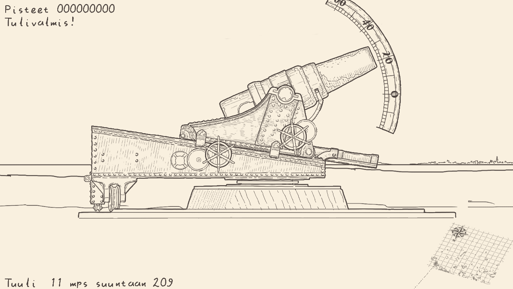
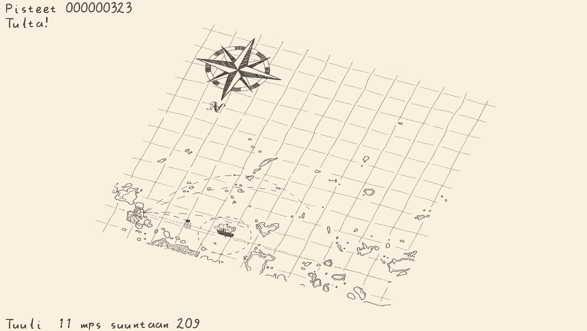

# Vaatimusmäärittely

 - [Sovelluksen tarkoitus](#Sovelluksen-tarkoitus)
 - [Käyttöliittymä](#Käyttöliittymä)
 - [Ominaisuudet](#Ominaisuudet)
    - [Pelimoottori](#Pelimoottori)
    - [Tykkipeli](#Tykkipeli)
 - [Jatkokehitys](#Jatkokehitys)
 - [Rajoitukset](#Rajoitukset) 

## Sovelluksen tarkoitus

Perinteinen piste-ennätysorientoitunut tykkipeli jossa pelaaja yrittää upottaa laivoja tykillä.

Ampuminen ei ole suoraviivaista, pelaajan täytyy asettaa sekä tykin kulma että ammuksen lähtönopeus oikein maaliin osuakseen. Lisähaasteena peli kulkee reaaliajassa, käyttää oikeaa skaalaa sekä simuloi (melko yksinkertaistetusti) joitain fysikaalisia ilmiöitä, kuten ilmanvastusta, tuulta sekä planeetan pyörimistä. Lisäksi laivat ovat luonnollisesti liikkuvia.

Pelissä on joitain internet-ominaisuuksia: piste-ennätykset tallennetaan nettiin, sekä tuuli haetaan reaaliajassa Harmajan mittausasemalta Ilmatieteenlaitoksen rajapintaa hyödyntäen.

## Käyttöliittymä

Käyttöliittymää ohjataan näppäimistöllä, esiasetetuilla kontrolleilla.

Toteutunut pelin käyttöliittymä

Luonnos pelin käyttöliittymälle

Toteutunut pelin karttanäkymä

Luonnos pelin karttanäkymälle

## Ominaisuudet

### Pelimoottori

 - Pelimoottori tukee spritejen piirtoa
 - Pelimoottori tukee kirjainten piirtoa
 - Pelimoottori tukee vektorien piirtoa
 - Pelimoottori tukee 3d-muunnoksia
 - Peliobjektit tukee periytyvyyttä, eli päivitys päällimmäiseen peliobjektiin propagoituu lapsiin
- Pelilogiikan on oltava kontekstiin suljettua, esim. valikoilla ja pelillä oma logiikka
- Peliobjekteja pitää pystyä animoimaan
- Tuki sekä ikkunalliselle- että kokoruuduntilalle (myös borderless windowed)
- Käyttäjän näppäinsyötteiden kuuntelu
### Tykkipeli

- Yleiset 
    - Peli pystyy näyttämään useita näkymiä samanaikaisesti
    - Näkymiä pitää pystyä piilottamaan ja pienentämään
    - Pienentäessä näkymä näyttää vaihtoehtoista näkymää
- Pääpeli
    - Oma logiikka ja päänäkymä
    - Kentän alustus kenttätiedoston perusteella
    - Liikkuvia maaliobjekteja jotka määritetään kenttätiedostossa
    - Tykkiä pystyy ohjaamaan näppäimistöllä, ohjauksessa täytyy olla inertiaa 
    - Tykin voi ladata erilaisilla ammuksen ja panosten yhdistelmillä
    - Tykin voi laukaista, laukaisu spawnaa projektiilin ja projektiili voi upottaa laivan
    - Projektiilin lentorata lasketaan fysiikkasimulaatiolla
    - Projektiilit ja laivat piirretään reaaliajassa karttaan
    - Projektiileille piirretään myös lentorata
    - Laivoille piirretään sen tykkien maksimikantama
    - Näkymä kartalle ja minikartalle
    - Näkymä tykin lataukselle
    - Näkymä pelin lopetukselle
    - Näkymä käyttöohjeille
    - Lopetusruudussa nimensyöttö jos piste-ennätys
    - Tuulen parametrit ilmaistaan
    - Kenttä päättyy kun pelaaja tai kaikki laivat tuhoutuu
    - Kentän päättyminen aktivoi pisteidenlaskun, nimensyötön ja seuraavan kentän spawnauksen jos pelaaja voittaa
    - Kentän päättyminen aktivoi mahdollisuuden uudelleenpeluulle tai lopetukselle jos pelaaja häviää
 - Simulaatio
    - Toimii 3d-avaruudessa
    - Dynaaminen kiihtyvyys
    - Ilmanvastus, gravitaation muutos, ilman tiheyden muutos, coriolis vaikuttaa simulaatioon
    - Tuuli otetaan huomioon simulaatiossa
    - Tuuli yhdistetään ilmatieteenlaitoksen rajapintaan

- Piste-ennätykset
    - Oma logiikka ja näkymä
    - Pisteet tallennetaan lokaalisti
    - Pisteet tallennetaan serverille
    - Pisteet on laskevassa järjestyksessä
    - Liikenne serverin välillä salattua

## Jatkokehitys

- [ ] Kenttädatan salaus
- [ ] Latausanimaatio tykille
- [ ] Tykin jalustan lähimaasto taustaa nopeammin liikkuvalle layerille, parallax
- [ ] Aktiivisen projektiilin alkuparametrien piirto karttanäkymään
- [ ] Seuraavaan waypointtiin siirtyminen maalikappaleelle
- [ ] Näppäinasetusten lataaminen tiedostosta
- [ ] Hiiritapahtumien seuraaminen, klikattavat objektit
- [ ] Useita tykkejä joiden välillä voi siirtyä
- [ ] Tekoälyn ohjaamat tykkiobjektit (jotka käyttää samaa rajapintaa kuin pelaajan ohjaamakin)
- [ ] Moninpeli
- [ ] Ei-pikselipohjainen skaala renderöijälle (esim metriyksiköt, pikselipohjaisuus vaikeuttaa eri pikselitiheydessä olevien kappaleiden käsittelyä)
- [ ] Maapallon kaarevuus huomioituna simulaatiossa
- [ ] Projektiilin pyöriminen (+magnus ilmiö) otetaan huomioon simulaatiossa

## Rajoitukset

Peli pyörii 64-bittisessä Linux- tai Windowskoneessa josta löytyy jonkinlainen näytönohjain ja JRE11. Peli on optimoitu 60Hz näytöille, muita päivitysnopeuksia tuetaan mutta niitä ei testata. 64-bittinen OSX ja 32-bittinen Windowsversio julkaistaan testaamattomana.