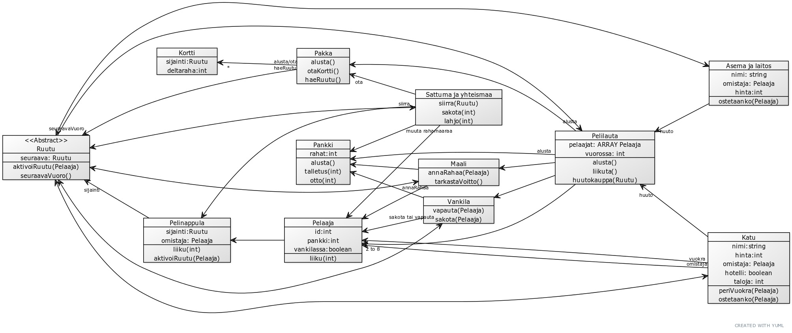

# Tehtävä 2
## YUML

    [Pelilauta]->[Maali]
    [Pelilauta]->[Vankila]
    [Pelilauta]->2 to 8[Pelaaja]
    [Pelilauta]alusta->[Pankki]
    [Pelilauta]alusta->[Pakka]

    [Maali]->[Pankki]
    [Vankila]->[Pankki]
    [Sattuma ja yhteismaa]->[Pankki]
    [Sattuma ja yhteismaa]->ota[Pakka]

    [Katu]->huuto[Pelilauta]
    [Asema ja laitos]->huuto[Pelilauta]
    [Maali]<->[<<Abstract>> Ruutu]
    [Katu]<->[<<Abstract>> Ruutu]
    [Sattuma ja yhteismaa]<->[<<Abstract>> Ruutu]
    [Vankila]<->[<<Abstract>> Ruutu]
    [Asema ja laitos]<->[<<Abstract>> Ruutu]

    [<<Abstract>> Ruutu]seuraavaVuoro->[Pelilauta]

    [Katu]omistaja->[Pelaaja]
    [Katu]vuokra->[Pelaaja]

    [Pelaaja]->[Pelinappula]
    [Pelinappula]-sijainti>[<<Abstract>> Ruutu]

    [Maali]annaRahaa->[Pelaaja]
    [Vankila]sakota tai vapauta->[Pelaaja]
    [Sattuma ja yhteismaa]siirra->[Pelinappula]
    [Sattuma ja yhteismaa]muuta rahamaaraa->[Pelaaja]

    [<<Abstract>> Ruutu|seuraava: Ruutu|aktivoiRuutu(Pelaaja); seuraavaVuoro()]
    [Katu|nimi:string; hinta:int; omistaja: Pelaaja; hotelli: boolean; taloja: int|periVuokra(Pelaaja);ostetaanko(Pelaaja)]
    [Maali|annaRahaa(Pelaaja);tarkastaVoitto()]
    [Pankki|rahat:int|alusta();talletus(int);otto(int)]
    [Pelinappula|sijainti:Ruutu;omistaja: Pelaaja|liiku(int);aktivoiRuutu(Pelaaja)]
    [Vankila|vapauta(Pelaaja);sakota(Pelaaja)]
    [Sattuma ja yhteismaa|siirra(Ruutu);sakota(int);lahjo(int)]

    [Pakka]alusta/ota->*[Kortti]
    [Pakka]haeRuutu->[<<Abstract>> Ruutu]
    [Pakka|alusta();otaKortti();haeRuutu()]
    [Kortti|sijainti:Ruutu;deltaraha:int]

    [Asema ja laitos|nimi: string; omistaja: Pelaaja; hinta:int|ostetaanko(Pelaaja)]

    [Pelaaja|id:int;pankki:int;vankilassa:boolean|liiku(int)]

    [Pelilauta|pelaajat: ARRAY Pelaaja; vuorossa: int|alusta();liikuta();huutokauppa(Ruutu)]