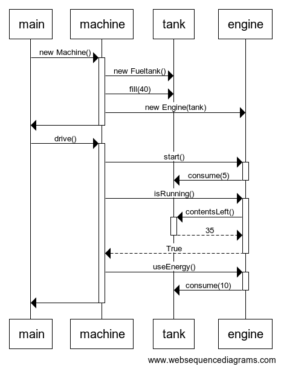

# Tehtävä 3

## websequencediagrams

    main->+machine: new Machine()
    machine->tank: new Fueltank()
    machine->tank: fill(40)
    machine->engine: new Engine(tank)
    machine->-main:
    main->+machine: drive()
    machine->+engine: start()
    engine->-tank: consume(5)
    machine->+engine:isRunning()
    engine->+tank:contentsLeft()
    tank-->-engine:35
    engine-->-machine:True
    machine->+engine:useEnergy()
    engine->-tank:consume(10)
    machine->-main: