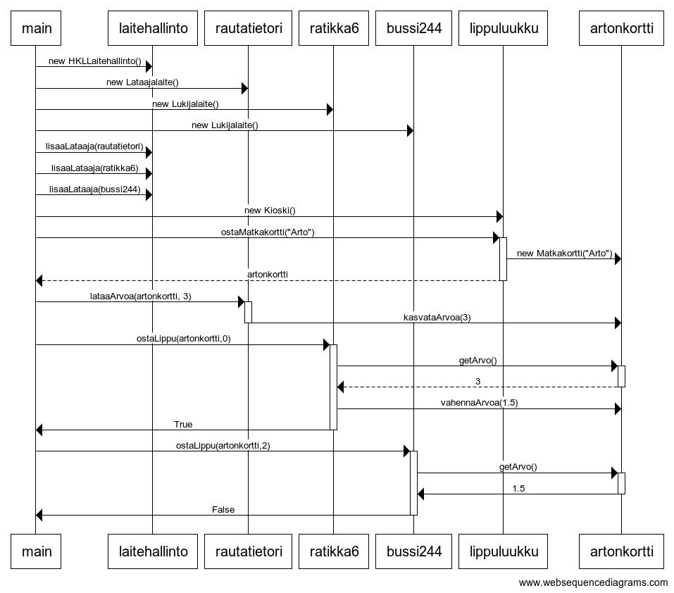

# Tehtävä 4

## websequencediagrams

    main->laitehallinto:new HKLLaitehallinto()
    main->rautatietori:new Lataajalaite()
    main->ratikka6:new Lukijalaite()
    main->bussi244:new Lukijalaite()

    main->laitehallinto:lisaaLataaja(rautatietori)
    main->laitehallinto:lisaaLataaja(ratikka6)
    main->laitehallinto:lisaaLataaja(bussi244)

    main->lippuluukku:new Kioski()
    main->+lippuluukku:ostaMatkakortti("Arto")
    lippuluukku->artonkortti:new Matkakortti("Arto")
    lippuluukku-->-main:artonkortti

    main->+rautatietori:lataaArvoa(artonkortti, 3)
    rautatietori->-artonkortti:kasvataArvoa(3)

    main->+ratikka6:ostaLippu(artonkortti,0)
    ratikka6->+artonkortti:getArvo()
    artonkortti-->-ratikka6:3
    ratikka6->artonkortti:vahennaArvoa(1.5)
    ratikka6->-main:True

    main->+bussi244:ostaLippu(artonkortti,2)
    bussi244->+artonkortti:getArvo()
    artonkortti->-bussi244:1.5
    bussi244->-main:False